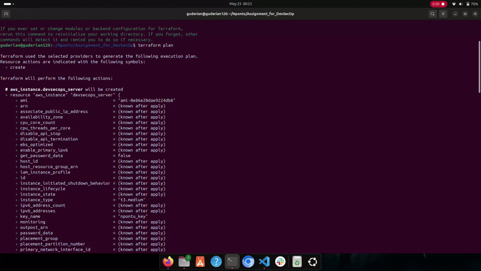
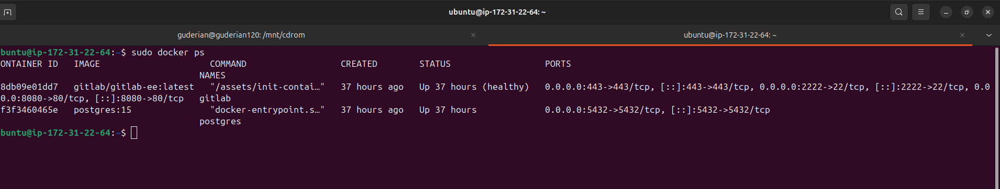
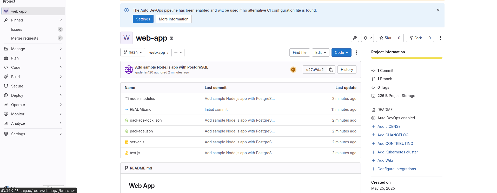
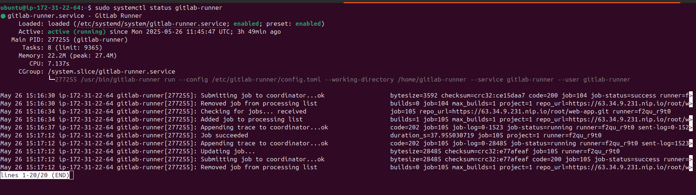
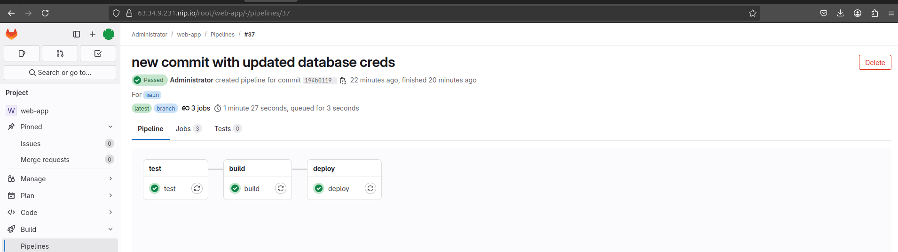

  # DevSecOps Environment Setup Guide

  ## Overview

  This project establishes a modern **DevSecOps environment** on an AWS EC2 instance (t3.medium, 8GB RAM, 16GB EBS volume) running Ubuntu 22.04. It leverages **Docker** to host GitLab for CI/CD and PostgreSQL for data persistence, with **Nginx** serving as a reverse proxy to secure traffic via HTTPS (port 443) to GitLab (port 8080) and a Node.js web application (port 3000 at `/app`). The **GitLab CI/CD pipeline**, executed entirely in Docker containers, automates testing, building, and deploying a Node.js application connected to PostgreSQL. Security is prioritized with **UFW**, **fail2ban**, and SSH key-based authentication, ensuring a robust and secure setup.

  ### Why This Setup?
  - **Infrastructure as Code (IaC)**: Terraform automates EC2 provisioning for reproducibility and scalability.
  - **Containerization**: Docker ensures consistent environments for GitLab, PostgreSQL, and CI/CD jobs, reducing "works on my machine" issues.
  - **CI/CD Automation**: GitLab pipeline streamlines testing, building, and deployment, enhancing development velocity.
  - **Security**: HTTPS, firewall rules, and intrusion prevention safeguard the environment.
  - **Scalability**: The setup supports team collaboration and can be extended for production use.

  ### Getting Started
  To set up this environment:
  1. **Prepare Prerequisites**: AWS account, Terraform, AWS CLI, EC2 key pair, and your public IP.
  2. **Clone Repository**: `git clone   --recurse-submodules  https://github.com/guderian120/NpontuAssignment`.
  3. **Follow Setup Instructions**: Use the steps below to provision infrastructure, configure services, and deploy the application.
  4. **Access the Environment**: Use GitLab (`https://63.34.9.231.nip.io/root/web-app`) and the web app (`http://63.34.9.231/app`).
  5. **Troubleshoot**: Refer to the troubleshooting section for common issues and solutions.

  This guide is designed for beginners, with each step explained to provide clarity and context. Images are included to illustrate key processes, and a table of contents ensures easy navigation.

  ## Table of Contents
  - [1. Prerequisites](#1-prerequisites)
  - [2. CI/CD Pipeline Overview](#2-cicd-pipeline-overview)
  - [3. Setup Instructions](#3-setup-instructions)
    - [3.1 Terraform Provisioning](#31-terraform-provisioning)
    - [3.2 Server Configuration](#32-server-configuration)
    - [3.3 SSL Configuration](#33-ssl-configuration)
    - [3.4 GitLab Project Setup](#34-gitlab-project-setup)
    - [3.5 GitLab Runner Setup](#35-gitlab-runner-setup)
    - [3.6 Server-Side Git Setup](#36-server-side-git-setup)
    - [3.7 Server-Side Sudo Permissions](#37-server-side-sudo-permissions)
    - [3.8 Developer Instructions](#38-developer-instructions)
    - [3.9 Application Deployment](#39-application-deployment)
  - [4. Screenshots](#4-screenshots)
  - [5. Troubleshooting Pipeline](#5-troubleshooting-pipeline)
  - [6. Maintenance](#6-maintenance)
  - [7. Destroying Resources](#7-destroying-resources)
  - [8. Verification](#8-verification)

  ## 1. Prerequisites
  **Purpose**: Ensure all tools and credentials are ready before starting to avoid setup delays.

  - **AWS Account**: Required for EC2 instance provisioning. Configure with Terraform and AWS CLI.
    - **Why**: AWS provides scalable cloud infrastructure; Terraform and CLI enable programmatic setup.
  - **EC2 Key Pair** (`my-key-pair.pem`): For secure SSH access to the EC2 instance.
    - **Why**: Key-based authentication enhances security over passwords.
  - **Public IP**: Run `curl ifconfig.me` to get your IP for SSH restrictions.
    - **Why**: Restricting SSH access improves security by limiting exposure.
  - **Tools**:
    - Terraform: For infrastructure provisioning.
    - AWS CLI: For AWS interactions.
    - Git: For repository management.
    - SSH client: For server access.
    - **Why**: These tools are industry-standard for DevOps workflows.

  **Steps**:
  1. Install Terraform: `https://www.terraform.io/downloads.html`.
  2. Install AWS CLI: `aws configure` with access key and secret.
  3. Create an EC2 key pair in AWS Console (save `my-key-pair.pem`).
  4. Note your public IP: `curl ifconfig.me`.

  ## 2. CI/CD Pipeline Overview
  **Purpose**: Automate the software delivery process with a robust, containerized pipeline to ensure quality and speed.

  The pipeline consists of three stages, each running in isolated Docker containers for consistency:
  - **Test Stage**:
    - **Image**: `node:16`
    - **Service**: `postgres:15`
    - **Actions**: Installs `postgresql-client`, runs `npm install`, waits for PostgreSQL with `pg_isready`, and executes `npm test` with Mocha (`tests/test.js`) to verify the `/app` endpoint using `supertest`.
    - **Why**: Ensures code quality and database connectivity before deployment.
  - **Build Stage**:
    - **Image**: `node:16`
    - **Actions**: Runs `npm install` and stores artifacts (excluding `node_modules`).
    - **Why**: Prepares dependencies for deployment without redundant file transfers.
  - **Deploy Stage**:
    - **Image**: `ubuntu:latest`
    - **Actions**: SSHes to the EC2 instance, pulls code with `git pull`, installs dependencies, and starts the app.
    - **Why**: Simplifies deployment by leveraging Git for version control, avoiding large file transfers.

  **Why Containers?**
  - **Isolation**: Prevents environment conflicts.
  - **Portability**: Runs consistently across systems.
  - **Efficiency**: Lightweight compared to VMs.

  ## 3. Setup Instructions

  ### 3.1 Terraform Provisioning
  **Purpose**: Automate EC2 instance creation for reproducibility and scalability.

  **Steps**:
  ```
  1. Clone the repository: `git clone --recurse-submodules https://github.com/guderian120/NpontuAssignment`.
  ```
  2. Update `variables.tf` with:
    - AMI ID (Ubuntu 22.04).
    - Key pair name (`my-key-pair`).
    - Your public IP for SSH.
  3. Run:
    ```bash
    terraform init
    terraform plan
    terraform apply
    ```
  4. Output: EC2 public IP (e.g., `63.34.9.231`).

  **Why**:
  - **IaC**: Terraform ensures consistent infrastructure.
  - **Scalability**: Easily modify or replicate the setup.
  - **Automation**: Reduces manual AWS Console usage.

  *Image*: .

  ### 3.2 Server Configuration
  **Purpose**: Set up essential services and security on the EC2 instance.

  **Steps**:
  - The Terraform User Data script:
    - Installs Docker, Nginx, Node.js, Python, and fail2ban.
    - Runs PostgreSQL in Docker (`devsecops` user, `app_db` database).
    - Runs GitLab EE in Docker (HTTP on 8080, SSH on 2222).
    - Configures Nginx to proxy `/` to `http://localhost:8080` and `/app` to `http://localhost:3000`.
    - Hardens security with UFW, fail2ban, and SSH restrictions.

  **Why**:
  - **Docker**: Isolates services for reliability.
  - **Nginx**: Secures and routes traffic.
  - **Security**: Protects against unauthorized access and attacks.

  *Image*: .

  ### 3.3 SSL Configuration
  **Purpose**: Secure GitLab and the web app with HTTPS.

  **Steps**:
  1. SSH: `ssh -i my-key-pair.pem ubuntu@<instance-public-ip>`.
  2. Install Certbot:
    ```bash
    sudo apt-get install -y certbot python3-certbot-nginx
    ```
  3. Obtain certificate:
    ```bash
    sudo certbot --nginx -d <instance-public-ip>.nip.io
    ```
  4. Update GitLab:
    ```bash
    sudo docker exec -it gitlab bash
    echo "external_url 'https://<instance-public-ip>.nip.io'" >> /etc/gitlab/gitlab.rb
    gitlab-ctl reconfigure
    ```

  **Why**:
  - **HTTPS**: Encrypts traffic for security.
  - **Certbot**: Automates certificate management.
  - **GitLab**: Requires correct URL for HTTPS access.


  ### 3.4 GitLab Project Setup
  **Purpose**: Create a repository for code and CI/CD configuration.

  **Steps**:
  1. Access GitLab: `https://<instance-public-ip>.nip.io`.
  2. Log in as `root` (password: `docker exec gitlab cat /etc/gitlab/initial_root_password`).
  3. Create `web-app` project (Visibility: Private).
  4. Add developers: Admin Area > Users (Developer/Maintainer roles).
  5. Add files: `.gitlab-ci.yml`, `server.js`, `tests/test.js`, `package.json`.
  6. Configure SSH:
    ```bash
    ssh -i my-key-pair.pem ubuntu@<instance-public-ip>
    ssh-keygen -t rsa -b 4096 -f ~/.ssh/id_rsa
    cat ~/.ssh/id_rsa.pub # Add to GitLab SSH Keys
    ```
    - Add private key to CI/CD Variables (`SSH_PRIVATE_KEY`).

  **Why**:
  - **GitLab**: Centralizes code and CI/CD.
  - **Collaboration**: Enables team contributions.
  - **SSH**: Secures pipeline authentication.

  *Image*: .

  ### 3.5 GitLab Runner Setup
  **Purpose**: Enable CI/CD job execution with a Docker-based runner.

  **Steps**:
  1. Install
    ```bash
    curl -L "https://packages.gitlab.com/install/repositories/runner/gitlab-runner/script.deb.sh" | sudo bash
    sudo apt-get update
    sudo apt-get install -y gitlab-runner
    ```
  2. Register
    ```bash
    sudo gitlab-runner register
    ```
    - URL: `https://<instance-public-ip>.nip.io`
    - Token: Admin Area > Runners
    - Description: `ec2-runner`
    - Tags: None
    - Executor: `docker`
    - Image: `docker:20.10.16`
  3. Configure
    ```bash
    sudo usermod -aG docker gitlab-runner
    sudo nano /etc/gitlab-runner/config.toml
    # Set
    concurrent = 1
    [[runners]]
      name = "ec2-runner"
      url = "https://<instance-public-ip>.nip.io"
      executor = "docker"
      [runners.docker]
        image = "docker:20.10.16"
        memory = "512m"
    sudo systemctl restart gitlab-runner
    ```

  **Why**:
  - **Runner**: Executes pipeline jobs.
  - **Docker**: Ensures job isolation.
  - **Optimization**: Prevents resource overuse.

  *Image*: .

  ### 3.6 Server-Side Git Setup
  **Purpose**: Enable `git pull` for deployment on the EC2 instance.

  **Steps**:
  1. Initialize repository:
    ```bash
    ssh -i my-key-pair.pem ubuntu@<instance-public-ip>
    sudo mkdir -p /var/www/html
    sudo chown ubuntu:ubuntu /var/www/html
    cd /var/www/html
    git init
    git remote add origin git@gitlab:root/web-app.git
    git fetch origin
    git checkout main
    ```
  2. Configure SSH:
    ```bash
    ssh-keygen -t rsa -b 4096 -f ~/.ssh/gitlab_deploy_key -N ""
    cat ~/.ssh/gitlab_deploy_key.pub # Add to GitLab SSH Keys
    echo -e "Host gitlab\n  HostName 63.34.9.231\n  User git\n  Port 2222\n  IdentityFile ~/.ssh/gitlab_deploy_key" > ~/.ssh/config
    chmod 600 ~/.ssh/config
    ```

  **Why**:
  - **Git**: Simplifies deployment with version control.
  - **SSH**: Secures repository access.
  - **Automation**: Enables CI/CD to update code.

  *Image*: Git setup (`media/cloning_from_repo.png`).

  ### 3.7 Server-Side Sudo Permissions
  **Purpose**: Allow passwordless `sudo` for deployment commands.

  **Steps**:
  1. Configure:
    ```bash
    ssh -i my-key-pair.pem ubuntu@<instance-public-ip>
    sudo visudo
    # Add:
    ubuntu ALL=(ALL) NOPASSWD: /usr/bin/git, /usr/bin/npm, /usr/bin/node
    ```

  **Why**:
  - **Sudo**: Required for `git`, `npm`, and `node` in deployment.
  - **Passwordless**: Prevents CI/CD prompts.
  - **Security**: Limits commands to specific binaries.


  ### 3.8 Developer Instructions
  **Purpose**: Guide developers to contribute to the project.

  **Steps**:
  1. Clone:
    ```bash
    git clone https://63.34.9.231.nip.io/root/web-app
    # or if you public key is added
    git clone git@63.34.9.231.nip.io:2222/root/web-app.git
    ```
  2. Add SSH key to GitLab (Settings > SSH Keys).
  3. Push to `main` to trigger the pipeline.

  **Why**:
  - **Collaboration**: Enables team development.
  - **CI/CD**: Automates testing and deployment.
  - **Access**: Supports both HTTPS and SSH.

  ### 3.9 Application Deployment
  **Purpose**: Deploy the Node.js app to production.

  **Steps**:
  - The pipeline:
    - Tests code in `node:16`.
    - Builds artifacts in `node:16`.
    - Deploys via `git pull` in `ubuntu:latest` to `/var/www/html`.
  - Nginx proxies `/app` to `http://localhost:3000`.

  **Why**:
  - **Automation**: Reduces manual deployment errors.
  - **Git Pull**: Simplifies code updates.
  - **Nginx**: Ensures reliable app access.

  *Image*: .

  ## 4. Screenshots
  **Purpose**: Visually document the setup process.

  | Step | Image Path |
  |------|------------|
  | Terraform Provisioning | `media/terraform_plan_output.gif` |
  | Docker Containers | `media/docker_containers.png` |
  | SSL Configuration | `media/ssl-certbot.png` |
  | GitLab Project | `media/gitlab-project.png` |
  | GitLab Runner | `media/gitlab-runner.png` |
  | Server-Side Git | `media/git-setup.png` |
  | Sudo Permissions | `media/sudoers-config.png` |
  | Pipeline Execution | `media/pipeline-execution.png` |
  | Web App | `media/web-app.png` |

  **Why**: Images enhance understanding and provide proof of completion.

  ## 5. Troubleshooting Pipeline
  **Purpose**: Resolve common pipeline issues.

  - **Pipeline Pending (Waiting for Runners)**:
    - Check: `sudo systemctl status gitlab-runner`
    - Start: `sudo systemctl start gitlab-runner`
    - Verify: `sudo cat /etc/gitlab-runner/config.toml`
    - Docker: `sudo docker info`, `sudo usermod -aG docker gitlab-runner`
    - Re-register: `sudo gitlab-runner register`
    - **Why**: Ensures runner availability.
  - **npm test: No Test Specified**:
    - Ensure `package.json`:
      ```json
      "scripts": {
        "start": "node server.js",
        "test": "mocha tests/test.js"
      }
      ```
    - **Why**: Defines test command.
  - **Test Job Fails (TypeError: app.address)**:
    - Update `server.js`:
      ```javascript
      if (require.main === module) {
        app.listen(3000, () => console.log('Server running on port 3000'));
      }
      module.exports = app;
      ```
    - **Why**: Allows testing without starting the server.
  - **Test Job Fails (500 Internal Server Error)**:
    - Ensure:
      ```yaml
      test:
        script:
          - apt-get update && apt-get install -y postgresql-client
          - npm install
          - until pg_isready -h postgres -U devsecops -d app_db; do sleep 1; done
          - npm test
      ```
    - **Why**: Waits for PostgreSQL readiness.
  - **Deploy Job Fails**:
    - Verify Git:
      ```bash
      ssh -i my-key-pair.pem ubuntu@<instance-public-ip>
      cd /var/www/html
      git pull origin main
      ```
    - Check `SSH_PRIVATE_KEY`.
    - Test SSH: `ssh -i ~/.ssh/id_rsa -p 22 ubuntu@<instance-public-ip>`.
    - Dependencies:
      ```bash
      sudo apt-get install -y nodejs npm git
      ```
    - **Why**: Ensures deployment prerequisites.
  - **Job Failed (Aborted: Terminated)**:
    - Check: `free -h`, `docker stats`, `dmesg | grep -i "killed"`
    - Swap:
      ```bash
      sudo fallocate -l 2G /swapfile
      sudo chmod 600 /swapfile
      sudo mkswap /swapfile
      sudo swapon /swapfile
      echo '/swapfile none swap sw 0 0' | sudo tee -a /etc/fstab
      ```
    - GitLab:
      ```bash
      sudo docker exec -it gitlab bash
      echo "gitlab_rails['env'] = {'MALLOC_ARENA_MAX' => '2'}" >> /etc/gitlab/gitlab.rb
      echo "sidekiq['concurrency'] = 10" >> /etc/gitlab/gitlab.rb
      gitlab-ctl reconfigure
      ```
    - **Why**: Prevents resource exhaustion.

  ## 6. Maintenance
  **Purpose**: Keep the environment operational.

  - Monitor: GitLab UI (CI/CD > Pipelines).
  - Check: `docker ps`, `docker logs gitlab`, `docker logs postgres`.
  - Update: `sudo apt-get update && sudo apt-get upgrade`.
  - Images: `docker pull gitlab/gitlab-ee:latest`, `docker pull postgres:15`.
  - SSL: `sudo certbot renew`.

  **Why**: Ensures reliability and security.

  ## 7. Destroying Resources
  **Purpose**: Clean up to avoid costs.

  - Run:
    ```bash
    terraform destroy
    ```
  - Backup:
    ```bash
    docker cp gitlab:/etc/gitlab /home/ubuntu/gitlab_config_backup
    docker cp postgres:/var/lib/postgresql/data /home/ubuntu/postgres_data_backup
    ```

  **Why**: Prevents unnecessary AWS charges.

  ## 8. Verification
  **Purpose**: Confirm the setup is functional.

  - GitLab: `https://63.34.9.231.nip.io/`.
  - Web app: `http://63.34.9.231/app`.
  - Logs: GitLab (CI/CD > Pipelines).
  - Files: `ssh -i <key>.pem ubuntu@<instance-public-ip>`, check `/var/www/html`.
  - PostgreSQL: `docker exec -it postgres psql -U devsecops -d app_db`.
  - Memory: `free -h` (~8GB).
  - EBS: `lsblk` (16GB).

  *Image*: Web app (`media/web-app.png`).

  **Why**: Validates successful deployment.
